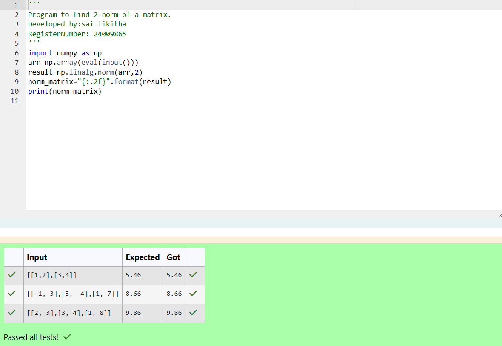
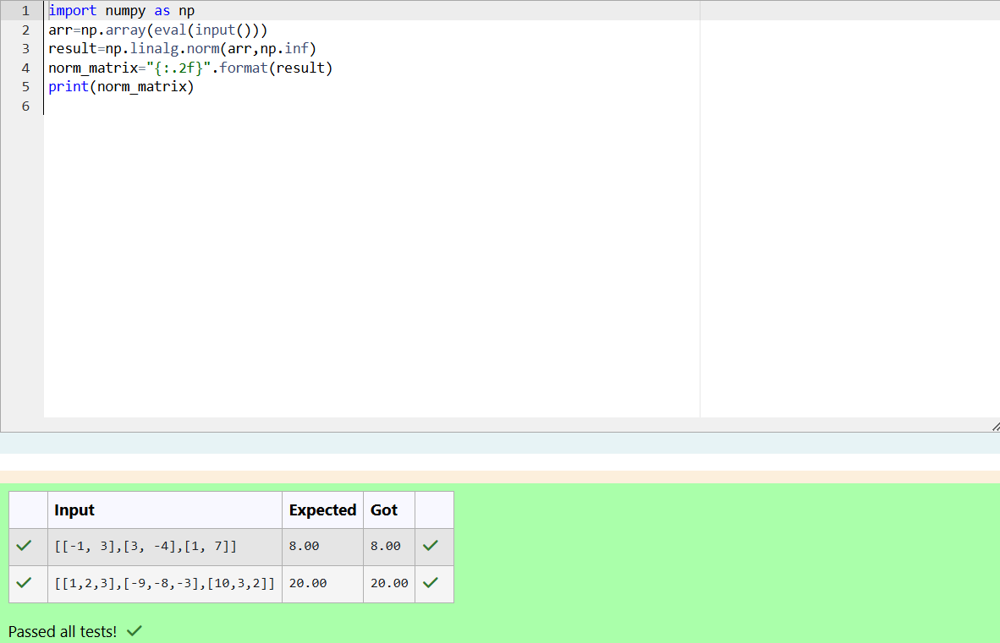

# Norm of a matrix
## Aim
To write a program to find the 1-norm, 2-norm and infinity norm of the matrix and display the result in two decimal places.
## Equipment’s required:
1.	Hardware – PCs
2.	Anaconda – Python 3.7 Installation / Moodle-Code Runner
## Algorithm for 1-Norm of a matrix:

```
1. Import numpy library.
2. Get user input for matrix and convert to numpy array.
3. Calculate 1-norm using np.linalg.norm() with ord=1.
4. Format result to two decimal places.
5. Print the result.

```

## Algorithm for 2-Norm of a matrix:

```

1. Import numpy library.
2. Get user input for matrix and convert to numpy array.
3. Calculate 2-norm using np.linalg.norm() with ord=2.
4. Format result to two decimal places.
5. Print the result.

```

## Algorithm for Infinity Norm of a matrix:

```

1. Import numpy library.
2. Get user input for matrix and convert to numpy array.
3. Calculate infinity norm using np.linalg.norm() with ord=np.inf.
4. Format result to two decimal places.
5. Print the result.

```


## Program:

```

Register No:24009865
Developed By:sai likitha

```

# 1-Norm of a Matrix

```

import numpy as  np
arr=np.array(eval(input()))
result=np.linalg.norm(arr,1)
norm_matrix="{:.2f}".format(result)
print(norm_matrix)

```

# 2-Norm of a Matrix

```

import numpy as np
arr=np.array(eval(input()))
result=np.linalg.norm(arr,2)
norm_matrix="{:.2f}".format(result)
print(norm_matrix)

```

# Infinity Norm of a Matrix

```

import numpy as np
arr=np.array(eval(input()))
result=np.linalg.norm(arr,np.inf)
norm_matrix="{:.2f}".format(result)
print(norm_matrix)

```

## Output:
### 1-Norm of a Matrix


### 2-Norm of a Matrix



### Infinity Norm of a Matrix



## Result
Thus the program for 1-norm, 2-norm and Infinity norm of a matrix are written and verified.
